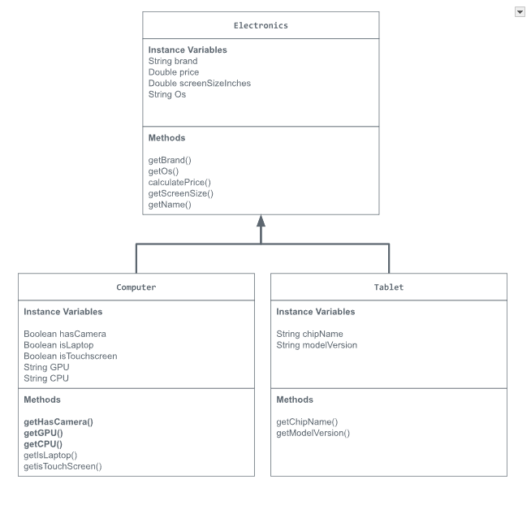

# Unit 2 - Electronics Store

## UML Diagram

Put and image of your UML Diagram here. Upload the image of your UML Diagram to your repository, then use the Markdown syntax to insert your image here.

## Description

I made an Electornics Store that sells computers and tablets of brands/operating systems such as Apple, Windows, and Android. I chose this topic because I am passionate about technology and I wanted to see how a mockup of an electronics store would look. Firstly, I made a superclass called "Electronics" which would represent the store as a whole with instance variables such as the price, brand, device, and screenSize. Then I made subclasses called "Computer" and "Tablet" which were the 2 types of products I was going to sell. The user will interact with these objects by first typing 1 or 2 in the console. If they typed 1 it would pick the Computer object and then set and get instance variables like isTouchscreen and isLaptop and update the Computer object's price based on the results. If the user typed 2 then it would pick the Tablet object, and set and get instance variables like the the camera megapixel (cameraMP) and update the price of the Tablet object based on the value. For both of these objects, it would update the screen and brand and assign their prices accordingly. It would then output the information using the object's toString method, which would add on to the information from the superclasses toString method, and output information about the devices name, brand, screenSize, and price. If the object was a Computer it would additionally output whether the computer was touchscreen and whether the computer was a laptop. If the object was a tablet it would in addition to the superclass information output the cameraMP instance variable. 